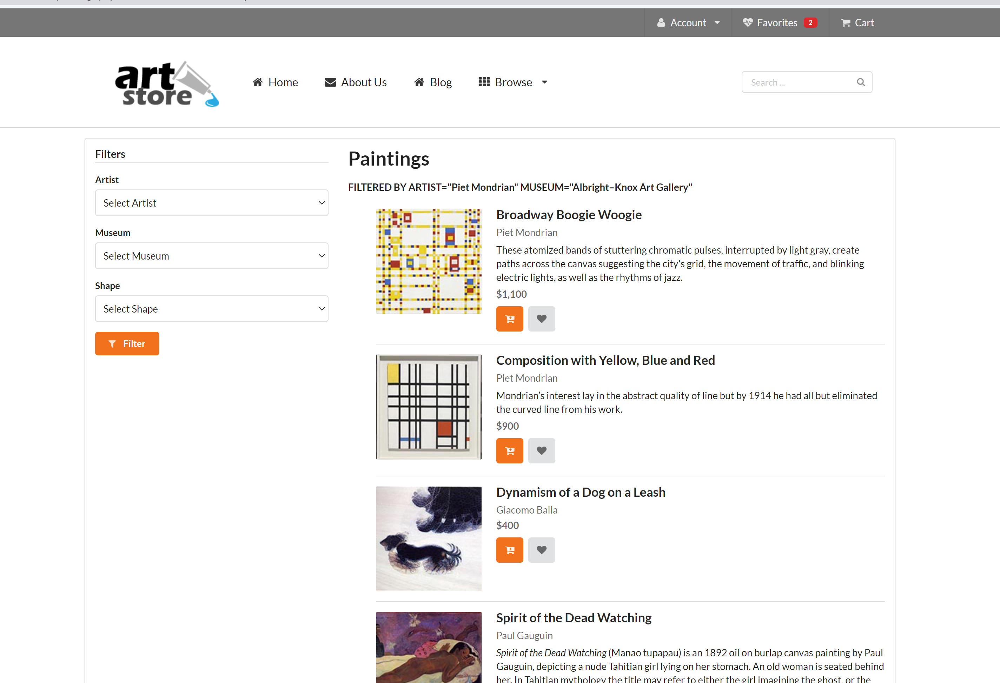
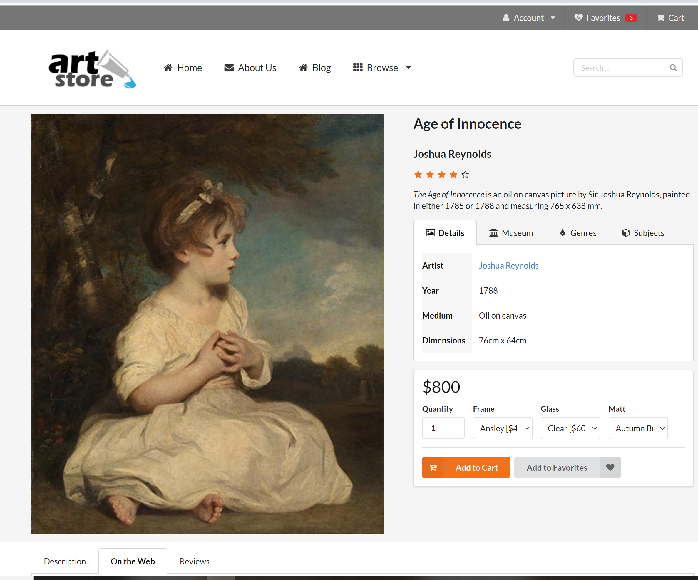
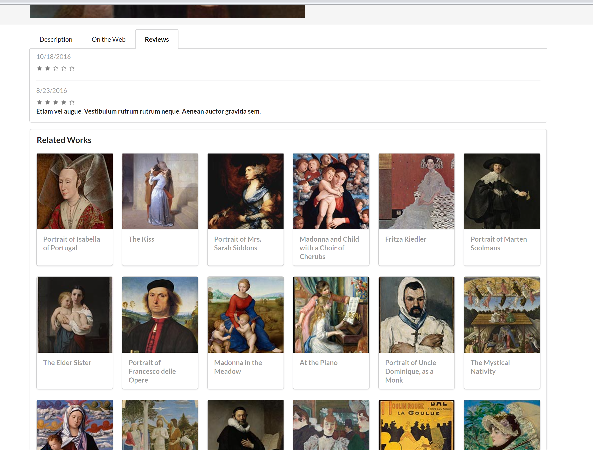
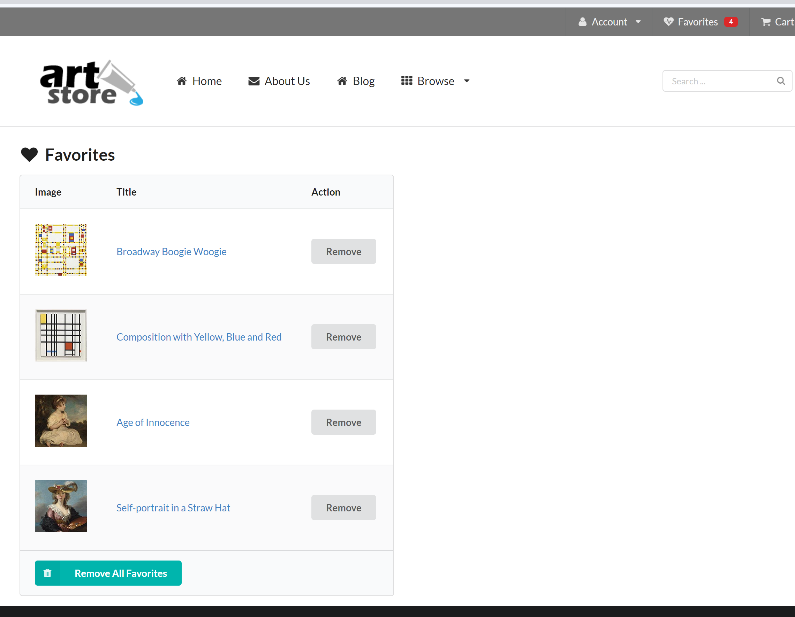

# Art Store Web App

## Dev

Have XAMPP up and running, as well as MariaDB with the given db (schema/prepop script [`art.sql`](db/art.sql)) loaded. Db creds are in [`art-config.inc.php`](includes/art-config.inc.php).  Optionally, spin up a memcache server to enable app data caching (configure via [`memcache-config.inc.php`](includes/memcache-config.inc.php)).  Memcache expiration is set to 30 seconds (defined at the top of the [`Artist`](includes/Artist.class.php), [`Gallery`](includes/Gallery.class.php), [`Painting`](includes/Painting.class.php), and [`Shape`](includes/Shape.class.php) class files).  To make testing easier, it is echoed whether the filter options and displayed paintings on the landing page (`browse-paintings.php`) are populated from the memcache server.

## Use

You can apply more than one filter at a time.  For instance, if you select both artist "Lawrence Alma-Tadema" and shape "Slim" and press the Filter button, you will see the paintings (up to 20) that fall under either category.  If a painting falls under multiple categories (like painting "Spring" falls under both the artist and shape in the example I gave), it will only be displayed once.  Filtered results are ordered alphabetically.

### Preview

- Browsing paintings on the landing page, in this case after filtering by artist and museum:

  
  &nbsp;

- After clicking on a painting from the landing page:

  
  &nbsp;

- Scrolling down and seeing other works related to the single painting (same artist or shape):

  
  &nbsp;

- Viewing favorited paintings:

  